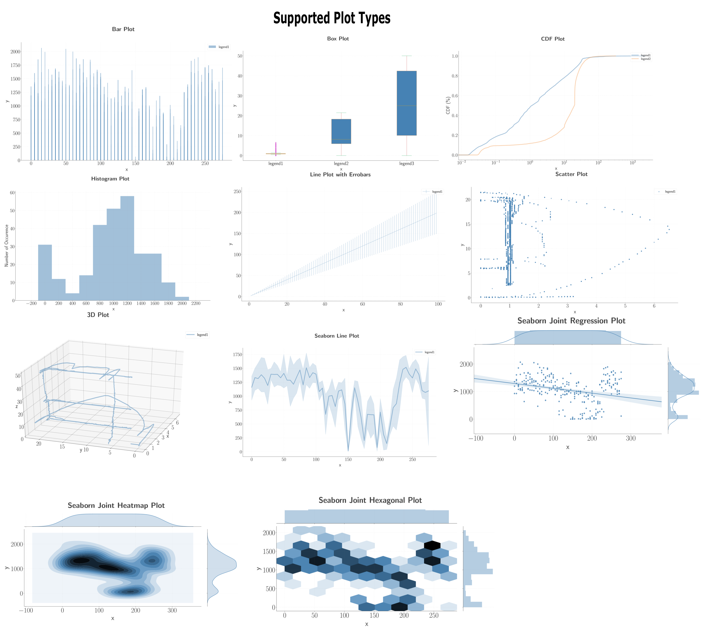
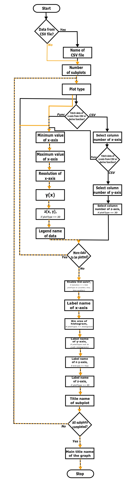

# Python Plotter

The PythonPlotter is an automized tool to provide a plotting platform with many features based on python matplotlib library. Whether you have sets of data or math functions to be plotted, this program can be utilized to plot your graphs without needing to write a python program. 
PythonPlotter takes either a csv file or a function as input and provides the desired plots. It is a user-interactive program to provide the highest level of flexibility to the user. Also, *config.py* allows user to flexibly set up certain configuration parameters for the program. 
Resulting plot is saved in the *logs/* directory. 

## Features
- No need for programming to generate plots. Simply give your input data or math function to PythonPlotter and plot your data. 
- Subplots are supported.
- Supported plot types: **bar, box, cdf, histogram, line, scatter, line+scatter** and **3D line**.
	- Flexibility of selecting any plot type for each subplot.
- Provide your input data either via csv file (delimeter type can be specified in the program) or generate x-axis based on *numpy.arange()* and create y-axis functions with *numpy.* or *math.* libraries.
- Flexibly enter your x- and y-axis labels, legend names, (sub)plot titles, etc.
	- axis labels and legend names can also be taken from csv file if provided in the first row of each data set (check out sample data file given in *inputCsvFiles/* directory.
- 3rd-axis support when two data sets are given in line, scatter and line+scatter plots
- Generated plots are automatically saved in *logs/.* directory in  *YearMonthDay_HourMinuteSecond* format. 

## Dependencies

Installation commamnds are given for Ubuntu (tested on Ubuntu 18.04).

**Program is written in Python3 (version 3.6)**

> sudo apt install python3-dev python3-pip

**Matplotlib, tk-inter**

> sudo apt install python3-matplotlib python3-tk

**Csv, numpy,colorama**

> pip3 install numpy colorama

## Usage

Simply run the program.

> ./pythonPlotter.py

The PythonPlotter will ask you questions to generate your plots. Answer to the questions accordingly. Check out the flow diagram and its explanation below to better understand how the program works. You may press *[Enter]* to answer to the questions with default values and you may exit the program at any phase by typing *[exit]||[EXIT]||[quit]||[QUIT]*.
Please note that the generated graph might seem misaligned on the GUI. Please check the saved figure in *logs/* directory for the actual output.

## Description of the Flow Diagram
- **Data from CSV file?** and **Name of the CSV file=**: Enter the csv file name of your input data (locate it in *logs/* directory or just skip this step if you will not use data file for your plots. You may also just copy/paste your data into *plotFromCsv.csv*
- **Delimeter of CSV File**: Enter the delimeter type of the CSV file. Default is *,*: 
- **Number of (sub)plots**: Enter the number of (sub)plots you want to plot
- **Plot Type**: Select your desired plot type (just enter the corresponding plot type number. )
- **Fetch data of x-axis from CSV or derive function?**: Although you added a CSV file as input, you may still derive data by function. Thus, you can select whether you want to fetch a data from your CSV file or just derive a function. 
- **Minimum value of x-axis**: Minimum value for the range of x-axis.
- **Maximum value of x-axis**: Maximum value for the range of x-axis.
- **Resolution of x-axis**: Resolution value for the range of x-axis.
- **y(x)**: Enter the function for y-axis (based on *x*). You may utilize *numpy.* as well as *math.* libraries or just simple python math expressions. 
- **z(x, y)**: Enter the function for z-axis (based on *x* and *y*). You may utilize *numpy.* as well as *math.* libraries or just simple python math expressions. This option pops up only if selected plot type is 3D. 
- **Select column number of x-axis**: Enter the column number of your csv file which should be used for x-axis in the plot. 
- **Select column number of y-axis**: Enter the column number of your csv file which should be used for y-axis in the plot. 
- **Select column number of z-axis**: Enter the column number of your csv file which should be used for z-axis in the plot. This option pops up only if selected plot type is 3D. 
- **Legend name of data**: Enter the legend name for your input data.
- **More data to be plotted?**: After entering legend name, the program will ask you whether you want to plot another set of data in the same graph. 
- **Enable 3rd-axis?**: If you used two different data sets in scatter, line or line+scatter okit types, then the program will ask you whether you want to enable the 2-nd y-axis on the plot. 
- **Label name of x-axis**: Type the label name for the x-axis of your plot. 
- **Bin size of histogram**: If selected plot type is histogram, PythonPlotter will ask you to enter the bin size of your plot, which will determine the resolution of the plot. 
- **Label name of y-axis**: Type the label name for the y-axis of your plot. 
- **Label name of z-axis**: Type the label name for the z-axis of your plot. This option pops up only if selected plot type is 3D.  
- **All subplots completed?**: PythonPlotter will keep looping and keep asking the questions above until the number of subplots which is defined by user is reached. 
- **Main title name of the graph**: Enter the main title name of your plots. 

Furthermore, please check out *config.py* where you will find further options to modify your plotting settings. 
Please report the bugs so that I can improve the program. Also, expect to run into bugs as this is currently the first version of the program and I need feedbacks to improve the program. Thanks!

## How to Add a New Feature to PythonPlotter? (To be Improved)
To add a new plot type: 
1. Add the name of your new plot type to the list *self.plotTypes*
2. Add the required plotting functions into the function *mainPlotter()*
3. If you need to define special type of requirements from user input, please check out the functions *checkUserInput()* and *acceptUserInput()*
4. Check out other functions inside the class *userInteractions* in order to aligm user inputs to the requirements of your plot type.

## Features to be Added in the Future:
1. Surface and wired 3D plots along with colorbars
2. Heat map plots
3. Multi-color box plots
4. Slider tabs for function-based plots 
5. Bar graphs with one data per sample
6. Error bar support for line plots